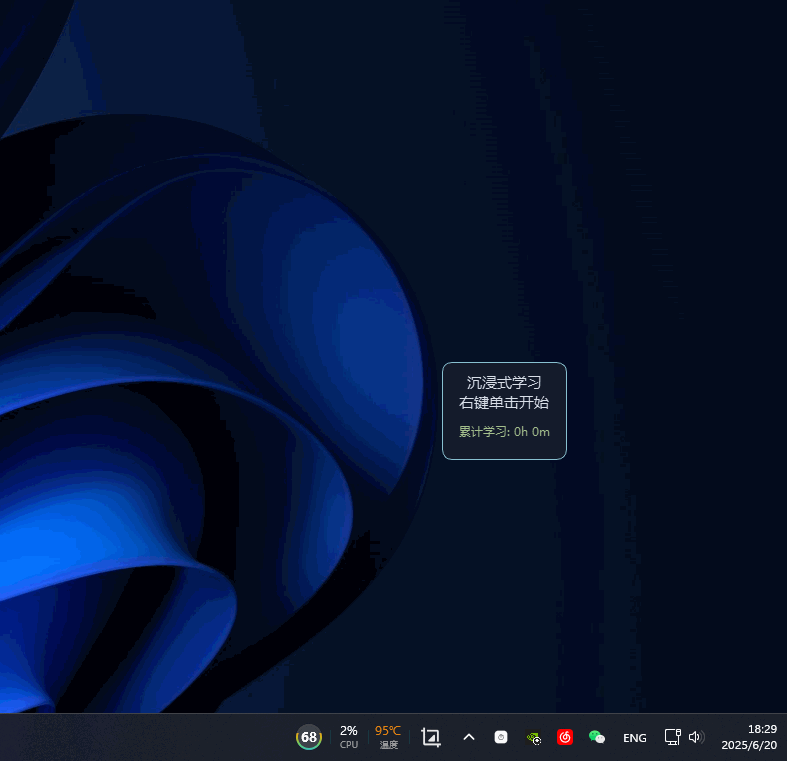

# 沉浸式学习计时器 (Immersive Study Timer)

]

一款专为对抗“计时器焦虑”而设计的桌面学习伴侣。它通过随机学习时长与自动长短休息机制，帮助你进入心流状态，让每一次专注都充满未知感和成就感。

## 源起与理念

本项目的创作灵感完全来自于 Bilibili UP主 **择恩** 的视频分享。视频中提出的“比番茄钟更好用的随机计时器”理念，完美解决了传统番茄工作法带来的“计时器焦虑”问题。

为了将这个优秀的理念付诸实践，并方便自己使用，我开发了这款桌面小工具。

> **核心理念来源**: [为什么我能每天学习10小时 - 择恩](https://www.bilibili.com/video/BV1naLozQEBq/?spm_id_from=333.1391.0.0&vd_source=ba468568caebc92479698e83c28be8b0)

## 核心特性

*   🎲 **随机周期**: 在设定的范围内随机生成学习时长，打破固定周期的枯燥。
*   ☕️ **智能休息**: 自动在短休息和长休息之间切换，确保劳逸结合。
*   🖱️ **鼠标穿透**: 可将窗口“锁定”，使其不响应任何鼠标事件，避免误触，不遮挡下方内容。
*   📊 **学习日志**: 自动记录每一次完成的学习会话到 `study_log.csv`，方便复盘和数据分析。
*   ⌨️ **全局热键**: 无需激活窗口，即可通过快捷键控制计时器的开始、暂停与重置。
*   🎨 **高度定制**: 通过 `config.json` 文件，可自由修改时间、声音、快捷键等所有参数。

## 快速开始 (推荐给普通用户)

1.  前往本项目的 [**Releases**](https://github.com/YOUR_USERNAME/YOUR_REPO/releases) 页面。
2.  下载最新的 `Study.Timer.vx.x.x.zip` 压缩包。
3.  解压后，双击运行 `study_timer_gui.exe` 即可！

## 使用指南

*   **移动与缩放**: 在“解锁”状态下，拖动窗口或右下角手柄。
*   **锁定/解锁**: **双击窗口** 或通过右键菜单切换。锁定后，窗口将对鼠标“透明”。
*   **右键菜单**: 在“解锁”状态下右键，可以访问所有功能。

#### 右键菜单功能

| 功能 | 说明 |
| :--- | :--- |
| **状态信息** | 显示当前计时器状态和距离长休息的预估时间。 |
| **▶️ 开始/继续** | 启动或从暂停中恢复计时。 |
| **⏸️ 暂 停** | 暂停当前计时。 |
| **🔒 锁定/🔓 解锁** | 切换鼠标穿透模式。 |
| **✅ 总在最前** | 设定窗口是否永远置顶。 |
| **💧 透明度** | 调整窗口的透明度。 |
| **🔄 重置** | **重置当前轮次**: 中止本轮，准备开始新一轮。<br>**清空所有记录**: 将累计学习时长清零（**有二次确认**）。 |
| **📂 打开日志文件夹**| 快速打开程序目录，查看日志和配置文件。 |
| **❌ 退 出** | 保存数据并安全退出程序。 |

#### 全局快捷键 (默认)

| 操作 | 快捷键 |
| :--- | :--- |
| 开始 / 继续 | `Ctrl` + `Alt` + `S` |
| 暂停 | `Ctrl` + `Alt` + `P` |
| 重置当前轮次 | `Ctrl` + `Alt` + `R` |

## 自定义配置 (`config.json`)

程序首次运行后会自动生成 `config.json` 文件。你可以用任何文本编辑器打开它进行修改，实现个性化定制。修改后需重启程序生效。

（部分参数说明）

| 参数 | 说明 |
| :--- | :--- |
| `study_time_min` | 每轮学习的最短时间 (秒)。 |
| `study_time_max` | 每轮学习的最长时间 (秒)。 |
| `long_break_threshold`| 触发长休息所需的累计学习总时长 (秒)。 |
| `hotkeys` | 定义全局快捷键，格式需遵循 `pynput` 库的规范。 |

## 面向开发者 (For Developers)

如果你想从源码运行或自行构建，请遵循以下步骤。

#### 1. 环境准备

*   安装 [Python](https://www.python.org/) (3.8+ 推荐)。
*   克隆本仓库: `git clone https://github.com/YOUR_USERNAME/YOUR_REPO.git`
*   进入项目目录: `cd YOUR_REPO`

#### 2. 安装依赖

本项目使用 `requirements.txt` 管理依赖。

```bash
pip install -r requirements.txt
```

#### 3. 从源码运行

```bash
python study_timer_gui.py
```

#### 4. 构建可执行文件 (.exe)

本项目使用 `PyInstaller` 进行打包。

```bash
# 首先确保已安装 PyInstaller
pip install pyinstaller
```

根目录提供了两个便捷的批处理脚本 (Windows):

*   `clear.bat`: 清理之前构建生成的文件 (`dist`, `build`)。
*   `clear_then_build.bat`: 功能同上述清理脚本，然后使用 `PyInstaller` 进行构建。

直接运行 `clear_then_build.bat`，构建成功后，可执行程序将位于 `./dist/study_timer_gui/` 文件夹内。

## 许可 (License)

本项目采用 [MIT License](LICENSE)。

## 致谢 (Acknowledgements)

*   再次感谢 Bilibili UP主 **择恩** 提供的绝佳灵感。
*   感谢所有为本项目提供支持的开源库，如 PyQt6, Pygame, Pynput。